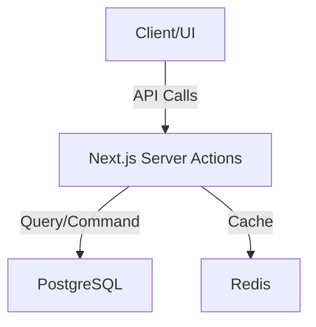

# ARCHITECTURE.md: System Mental Map

This provides the System Mental Map. It tells the agent where things live and how they talk to each other.

- **Contents:** Data flow, tech stack, directory structure, and API boundaries.
- **Utility:** Helps agents understand where to place new files and how services interact.

## System Flow

Include a mermaid graph of the entire system flow.

## Tech Stack

### Frontend
- **Framework:** Next.js (App Router)
- **Styling:** Tailwind CSS (Vanilla CSS preferred for custom components)
- **State:** TanStack Query for server state.

### Backend
- **Runtime:** Node.js
- **ORM:** Prisma or Drizzle
- **Database:** PostgreSQL

## Directory Structure Explanations

- `/src/components`: UI-only atoms and molecules. Strictly presentational.
- `/src/lib`: Core business logic, independent of UI frameworks.
- `/src/services`: External API wrappers or heavy data processing.

### Good Directory Constraint
"All business logic resides in `/src/lib`. Components are strictly for presentation and must not contain `useEffect` for data fetching."
*Utility: Prevents 'spaghetti code' and ensures predictable data flow.*

### Bad Directory Constraint
"Put files wherever they fit."
*Utility: High friction for agents trying to locate existing patterns, leading to duplicate code.*

## API Boundaries

Describe how services interact.
- **Example:** "The Mobile app consumes the same GraphQL endpoint as the Web app. No direct DB access for clients."

## Production Deployment Checklist

_Purpose: Ensure nothing is missed when deploying to production. Add this section once your architecture is defined._

### Environment Variables

Document every required env var with its purpose and how to obtain it. Make sure your `.env` files are secured for agentic work prior to deploying to production. Consider tools like [VestAuth](https://github.com/vestauth/vestauth) or similar secrets management solutions to prevent AI agents from accidentally leaking credentials.

| Key | Description | How to Obtain |
|-----|-------------|---------------|
| `DATABASE_URL` | Production PostgreSQL connection string | Provision a managed Postgres instance |
| `AUTH_SECRET` | Token signing secret | `openssl rand -hex 32` |

### Infrastructure Steps

- [ ] Custom domain configuration
- [ ] Database migration (e.g., `prisma migrate deploy` or equivalent)
- [ ] OAuth credentials with production redirect URIs
- [ ] Secrets management (never use plaintext `.env` in production)
- [ ] Monitoring and error tracking setup
- [ ] Automated database backups
- [ ] CORS configuration for production origins

## Observability

Set up observability before you need it. Bare `console.log` / `print` is not enough at production scale.

- **Request tracing.** Every inbound request gets a unique opaque ID at ingress. Propagate it through the call graph via the language's context primitive (Node.js: `AsyncLocalStorage`; Python: `contextvars`; Go: `context.Context`). Every log line, every outbound HTTP call, and every queue message carries the ID. This lets you stitch a user-visible failure back through every service it touched.
- **Structured logs over freeform strings.** Log JSON fields the collector can index (`{userId, route, durationMs, ok}`), not concatenated sentences. Treat every logged field as searchable and publicly visible — never put PII or secrets in a log line.

## Infrastructure-as-Code

A few rules that prevent the most painful IaC foot-guns:

- **Read secrets from a parameter store at apply time, not from CLI flags or `TF_VAR_*` env vars.** Terraform / Pulumi / OpenTofu data sources can pull from AWS SSM, GCP Secret Manager, or Vault directly. If the parameter is missing, the plan crashes loudly — much better than silently writing an empty string into a Lambda env var when you forget a `-var=` flag.
- **Never default a secret-typed variable to `""` in code.** An empty default plus a forgotten override equals a deployed function with empty credentials and no failure signal at apply time.
- **Isolate environments via workspaces (separate state files), not git branches.** Each environment has its own state tracking its own resources. Always verify the active workspace and `*.tfvars` file match before any `apply` — mismatching them destroys the wrong environment's resources.
