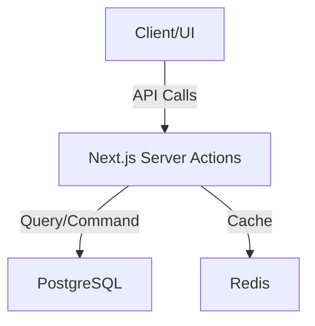

# ARCHITECTURE.md: System Mental Map

This provides the System Mental Map. It tells the agent where things live and how they talk to each other.

- **Contents:** Data flow, tech stack, directory structure, and API boundaries.
- **Utility:** Helps agents understand where to place new files and how services interact.

## System Flow

Include a mermaid graph of the entire system flow.

## Tech Stack

### Frontend
- **Framework:** Next.js (App Router)
- **Styling:** Tailwind CSS (Vanilla CSS preferred for custom components)
- **State:** TanStack Query for server state.

### Backend
- **Runtime:** Node.js
- **ORM:** Prisma or Drizzle
- **Database:** PostgreSQL

## Directory Structure Explanations

- `/src/components`: UI-only atoms and molecules. Strictly presentational.
- `/src/lib`: Core business logic, independent of UI frameworks.
- `/src/services`: External API wrappers or heavy data processing.

### Good Directory Constraint
"All business logic resides in `/src/lib`. Components are strictly for presentation and must not contain `useEffect` for data fetching."
*Utility: Prevents 'spaghetti code' and ensures predictable data flow.*

### Bad Directory Constraint
"Put files wherever they fit."
*Utility: High friction for agents trying to locate existing patterns, leading to duplicate code.*

## API Boundaries

Describe how services interact.
- **Example:** "The Mobile app consumes the same GraphQL endpoint as the Web app. No direct DB access for clients."
